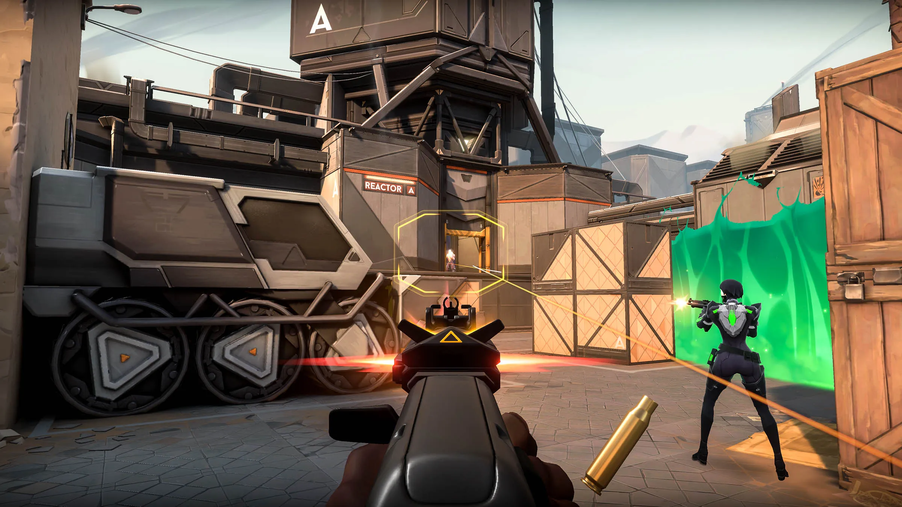

# HW for Feb2
## What's your favorite game and why?
#### My favorite game is *Valorant*. I like it because it has colorful and bright scenes; great music, especially the main menu ones(fav are Ep6 ActIII Ep7 ActI); and lastly, lots of agents with unique background and abilities. Also, for someone who hasn't played any fps game before, this one feels easy to get started.
## Which game development company made it? Include a URL to their website.
#### The company is *Riot Games*.
##### https://www.riotgames.com/en
## Release date of the game?
#### June 2, 2020
## The game engine used to make the game?
#### Unreal Engine 4
## Pics

## A list of similar or related games (include a link to the homepage of that game):
### Same company;
#### - *League of Legends*
##### https://www.leagueoflegends.com/en-us/
#### - *Teamfight Tactics*
##### https://teamfighttactics.leagueoflegends.com/en-us/?utm_medium=card3%2Bwww.riotgames.com&utm_source=riotbar 
#### - *Legends of Runeterra*
##### https://playruneterra.com/en-us/?utm_medium=card4%2Bwww.riotgames.com&utm_source=riotbar
### Similar games;
#### - *Counter-Strike 2*
##### https://www.counter-strike.net/cs2
#### - *Apex Legends*
##### https://www.ea.com/games/apex-legends?isLocalized=true
#### - *Overwatch 2*
##### https://overwatch.blizzard.com/zh-tw/ 

